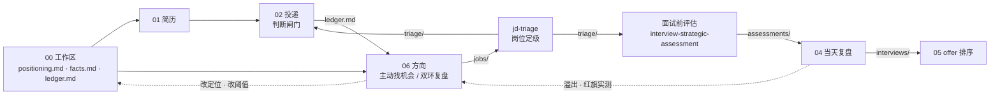

# AI Native 求职全案

**一套写给 agent 读的求职方法论。不是投递脚本，是每个决策点上的判断纪律。**

它帮你在四个时刻少走弯路：**投之前**判断这个岗位值不值得投，**面试前**看清这家公司站不站得住，**面试后**把每一场变成修正方向的证据，**拿到 offer 后**排出先后并知道哪个假设变了排序会翻。

> 你需要的唯一东西：**一个能读写本地文件的 agent**（Claude Code / Codex / Cursor 之类）。
> 不需要会写代码、不需要装任何东西、不需要先读完整套方法论、不需要用某个特定的 agent 产品。

> 本仓库里的 **offer 指「录用通知」**（公司发给你的那份），不是招聘启事。

---

## 30 秒开始

1. 在下面的表里找到最像你现在处境的那一行
2. 打开那一行的链接，里面有一份 `SKILL.md`，**整份贴给你的 agent**
3. 说一句你手上有什么。比如：

```text
这是 modules/03-company-analysis/jd-triage/SKILL.md。我把一份 JD 贴在下面，帮我判断值不值得投。
我的必要条件是：能直接对接业务方、可以远程。排除条件是：纯外包、不写代码。
```

```text
这是 modules/05-offer/SKILL.md。我有两个 offer，加上现在这份工作，下面是各自的薪资结构和通勤时间。
```

```text
这是 modules/00-workspace/SKILL.md。我什么都还没整理，先帮我把工作区建起来，简历在 resume.pdf。
```

**缺东西不是错误。** 没有一个模块会因为你少给了一份文件就停下来报错。它会告诉你缺什么、能不能降级跑、降级之后哪部分结论会变弱。每份 `SKILL.md` 顶部的「开跑前」一节写了它要什么、最少给到什么程度就能开始。

---

## 你现在卡在哪一步？

| 你会说的那句话 | 用哪一块 | 跑完你会拿到什么 |
|---|---|---|
| "我什么都还没准备好，也不知道从哪开始" | [`00-workspace`](modules/00-workspace/) | 一个 agent 能直接干活的工作区骨架。不需要先想清楚方向，骨架会带着你把想法慢慢填进去；建一次，之后不用每次重讲"我是谁" |
| "我要 AI 帮我改简历，但绝不能让它编造或美化我的经历" | [`01-resume`](modules/01-resume/) | 保持事实的定制简历、主动改进建议、单页 PDF 核验、独立审查记录 |
| "投之前我想先知道这个岗位值不值得投" | [`jd-triage`](modules/03-company-analysis/jd-triage/) | 结构化的岗位表和四级定级，理由能追到你自己写的哪一条条件 |
| "我想让投递定时无人值守地跑，但它必须仍然在做判断" | [`02-apply`](modules/02-apply/) | 判断闸门式投递闭环：缺判断条件就拒绝发送（只读探索和补条件仍可以做），节奏引擎，命中风控信号后自动停手直到你手动解除，每日 review 卡 |
| "明天要面试，这家公司到底靠不靠谱、我该问什么" | [`interview-strategic-assessment`](modules/03-company-analysis/interview-strategic-assessment/) | 四框架疑点表、一页纸问题清单（每条标注对方大概率能不能答）、红旗绿旗判据 |
| "刚面完，感觉答得不好但说不清哪不好" | [`04-interview`](modules/04-interview/) | 当天复盘卡：被问了什么、哪里答不好、红旗绿旗三态回填，跑题聊嗨的那部分也留下来 |
| "手上有两个 offer（还有留在原地），到底去哪个" | [`05-offer`](modules/05-offer/) | 横向对照表、排序、翻转点（哪个假设变了排序会翻）。不给你一个假装精确的综合分 |
| "只有一个 offer，不知道该不该接" / "没在找工作，但现在这份越待越不对劲" | [`05-offer`](modules/05-offer/) | 同一个模块的单列用法：它过不过得了你自己写下的线，什么变了你就该开始看外面。出的是过 / 不过，不是名次 |
| "投了一批没什么回音，是不是该换个方向" | [`06-positioning`](modules/06-positioning/) | 周期报告：归因到表述、阈值还是方向，样本不够时明确告诉你"本轮不改"；也可以在还没有投递台账时就按你的画像主动找机会 |

> `modules/03-company-analysis/` 这一层没有 `SKILL.md`，它下面是两个独立子模块：`jd-triage/` 投之前用，`interview-strategic-assessment/` 面试之前用。要打开的是子模块目录。

**先跑 `00-workspace` 吗？** 逻辑上它是所有模块的上游，其他模块读写的文件都是它建出来的。但没有任何模块强制你先跑完它。第一次用可以跳过，直接把一份 JD 或刚面完的事贴给对应模块；用到第二、第三次，你会自己回来建工作区。

**八个模块怎么接在一起**（每条箭头都是一个文件，模块之间只靠文件交接，任一上游缺失都能降级跑）：



实线是主链路，虚线是反馈边：每一场面试都会回到方向模块，再回到定位文件。这是这套东西和"投得更多"类工具最大的区别。

**最快见效的一个**：手上正好有两个 offer 的人，直接用 [`05-offer`](modules/05-offer/)，不需要接受这里的任何其他东西。不想让 agent 替你算、只想自己想清楚？看 [`05-offer/透镜库.md`](modules/05-offer/透镜库.md)：八个角度，每个在纸上十分钟做完，不出结论也不排序。

---

## 它和已有的求职开源项目有什么不一样

这条赛道已经有几个数万 star 的全链路项目（career-ops、ai-job-search、Resume-Matcher）。它们把流程跑起来这件事已经做得很好，这里不重新发明。这个仓库只做**跑之前和跑之后的判断**：

| | 已有全链路项目 | 这里 |
|---|---|---|
| 简历 | 给 LLM 素材，按规则生成 | 事实池是唯一真相，事实可追溯，表达可主动优化 |
| 岗位 | 匹配度打分 | 匹配度之外，硬性排除条件不可被匹配度换 |
| 面试 | 帮你准备怎么答 | 先判断这家公司站不站得住，问题是评估的副产品 |
| offer | 条款整理 / 加权总分 | 排序 + 翻转点，不出综合分 |
| 投递 | 生成材料辅助人工提交，或无人值守无判断执行 | 判断闸门式投递：缺判断条件拒绝发送，命中风控信号后自动停手 |
| 输出 | 一个分数 | 一个能追到具体条件的结论，以及它建立在哪些假设上 |

逐项对照与调研出处：[`docs/ecosystem.md`](docs/ecosystem.md)

---

## 不做什么

写在这里是为了防止以后被"用户有需求"撑爆边界。

- ⛔ **不专门指导/建议绕过平台的技术防护措施**。这管的是"仓库建议什么"，不管"你自己用什么执行引擎"，完整说明见 [`modules/02-apply/README.md`](modules/02-apply/README.md)
- ⛔ **不教在简历里植入影响 AI 初筛的内容**。那是操纵，不是判断力
- ⛔ **不采集他人个人信息**（HR、其他候选人），**不做全站数据抓取**
- ⛔ **不提供无上限的投递配置**。无差别大量投递不是这套方法论要解决的问题，恰恰是它要避免的失败模式
- **不做执行层**。底层投递引擎建议直接用现成的开源实现，见 [`docs/ecosystem.md`](docs/ecosystem.md)
- **不预测面试题，不给标准答案话术；不给 offer 打综合分；不告诉你该不该转行**，只把可能性摆上台面并给出证伪它的方式
- **受益人始终是候选人。** 这里不做"帮公司筛人"的任何东西

---

## 已知局限

1. **样本 n=1。** 这套方法论来自一次真实求职实践，尚未在多人身上验证。目前有两位试用者的初步反馈，还不够构成证据
2. **所有阈值都是编的。** 文中每个数字都标了来源等级（`实践校准` / `默认建议值` / `纯占位待校准`）。不要照抄，按你自己的情况重新标定
3. **自测测的是规则有没有区分力，测不了阈值对不对。** 八个模块、50 对「该触发 / 不该触发」样本，明细见 [`fixtures/README.md`](fixtures/README.md)；还没被人测过的事列在 [`docs/workspace-architecture.md`](docs/workspace-architecture.md) 的局限一节

**欢迎提 issue 讲你的反例。** 这个仓库最缺的就是第二个人的数据。

---

## 想了解更多

<details>
<summary><b>如果你打算连着跑两个以上模块：先后关系</b></summary>

各模块可以独立跑，顺序随你。只有当你确定要连着跑两个以上模块时，下面这张表才用得上。

| 如果这两个你都想跑 | 建议的顺序 | 为什么 |
|---|---|---|
| 手上有 offer，但同时在怀疑整个方向对不对 | 先 [`06-positioning`](modules/06-positioning/)，再 [`05-offer`](modules/05-offer/) | offer 模块默认"方向没问题，问题只是选哪个"。方向不成立时，你会在一个不该走的方向里认真选出最优解，而且排得越仔细越难回头 |
| 面试前评估 + 当天复盘 | 评估必须在面试前跑 | 复盘要回填的三态，对象是面试前成对写下的红旗绿旗。面试完再补一律降级成"事后补的基准，可信度低"，不喂给下游 |
| 岗位定级 + 面试前评估 | 先定级 | 评估里的疑点会直接引用定级时写下的条件编号 |
| 简历定制 + 判断闸门式投递 | 先出简历再投递 | 投递的打招呼语优先用简历模块的素材；没有就退化成通用模板，并明说"文本同质化风险" |
| 岗位定级 + 判断闸门式投递 | 先定级 | 投递的硬门槛过滤读的是定级结果；没有它，判断闸门缺一环，拒绝发送 |

</details>

<details>
<summary><b>换个 agent 还能不能用</b></summary>

能。这里全部是 markdown，没有一行可执行代码，也不依赖任何 agent 产品的专有机制：不需要注册斜杠命令、不需要自动加载或特定目录约定、不需要装 runtime 或 CLI、不需要 git。

`SKILL.md` 只是一个文件名约定，把文件整份交给你的 agent 即可。工作区里给 agent 看的那份约束文件模板叫 `AGENTS.md`；如果你的 agent 读的是别的名字，改个名就行，内容不用动。

唯一的可执行代码是 [`tools/md2pdf`](tools/md2pdf/)（简历模块用来出 PDF），并且配了不用它也能完成的退路。

</details>

<details>
<summary><b>每个 SKILL.md 都长同一个形状</b></summary>

这是发布门禁，缺任一段不许发：

| 段 | 它保证的事 |
|---|---|
| **开跑前** | 你知道要准备什么，以及最少给到什么程度就能开始 |
| **来源标注** | 每条结论标 `你给的` / `公开可查` / `我推测的`；推测项必须附"要证实它，你该问谁 / 查什么" |
| **不对劲的时候** | 跑歪了在对话里就能排查：症状 → 最可能原因 → 你下一句该说什么 |
| **三级自救阶梯** | agent 卡住时先自己找路并把学到的写回文件，实在不行才回来问你，且必须带上"我已经试过什么、建议你做什么" |

这四段是 markdown，不是某个诊断命令。排查的执行者是你手上的 agent，仓库只负责给它判据。

</details>

<details>
<summary><b>目录与路线</b></summary>

| 位置 | 内容 |
|---|---|
| [`docs/workspace-architecture.md`](docs/workspace-architecture.md) | 方法论总览：五条理念、五阶段主链路、三支线、agent 分工、治理判断层、局限 |
| [`docs/module-contracts.md`](docs/module-contracts.md) | 模块之间唯一的耦合点：11 个契约文件的最小字段，以及上游缺失时怎么降级 |
| [`docs/ecosystem.md`](docs/ecosystem.md) | 与已有开源项目的分工与出处 |
| [`modules/`](modules/) | 各模块。README 回答"单独能用吗 / 依赖谁 / 缺了退化成什么"，SKILL 是正文，templates 是空表 |
| [`examples/`](examples/) | 走通一遍长什么样。全部虚构，不含任何真实素材 |
| [`fixtures/`](fixtures/) | 自测语料：每条判断规则一对「该触发 / 不该触发」样本 |
| [`CHANGELOG.md`](CHANGELOG.md) | 版本与契约迁移说明 |
| [`CONTRIBUTING.md`](CONTRIBUTING.md) | 维护约定：编号自包含、示例虚构、不写个人事实、每条规则配固件 |

| 版本 | 内容 |
|---|---|
| **v0.1**（当前） | 工作区、简历整理、岗位定级骨架、面试前策略性评估、当天复盘协议、offer 排序、方向双环与主动机会探索、判断闸门式投递 |
| 接下来 | 岗位定级完整模板（当前只发骨架，具体阈值需要你自己标定） |

</details>

---

## English summary

A job-search methodology written for AI agents, not a submission script. It covers the judgment points a job seeker actually faces: whether a role is worth applying to, whether a company holds up before the interview, what each interview tells you about your positioning, and how to rank offers with explicit flip points instead of a fake composite score.

All content is plain markdown. The only requirement is an agent that can read and write local files (Claude Code, Codex, Cursor, etc.). Pick the situation you are in from the table above, paste that module's `SKILL.md` to your agent, and tell it what you have. Missing inputs degrade gracefully; nothing errors out.

Boundaries: no guidance on evading platform protections, no hidden resume content aimed at AI screeners, no scraping of other people's data, no unlimited submission settings, and the beneficiary is always the candidate. Sample size is one real job search plus two early testers; every threshold is labeled by how trustworthy it is. Issues with counterexamples are welcome.

## License

[MIT](LICENSE)
